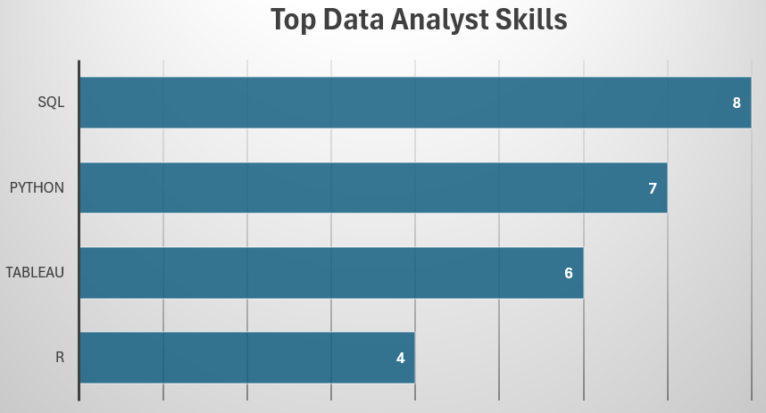
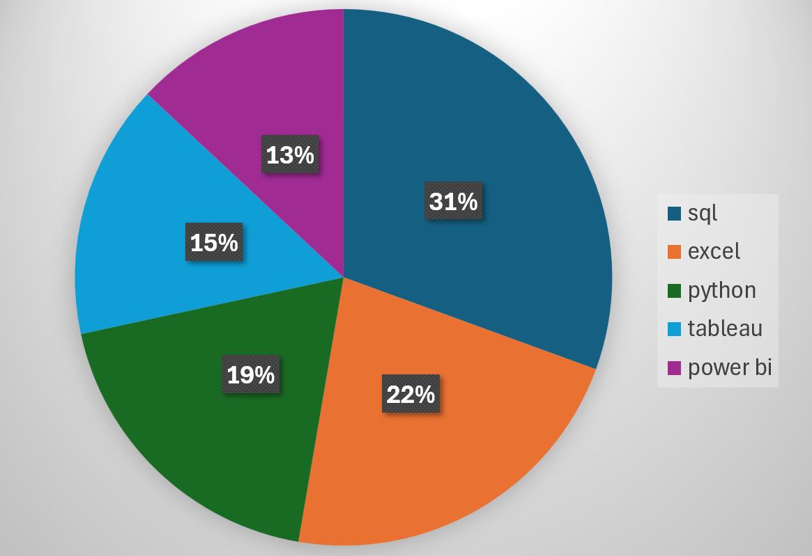

# Introduction
Dive into the data job market! Focusing on data analyst roles, this project explores: 
- top-paying jobs
- in-demand skills
- where high demand meets high salary 

SQL Queries: [project_sql folder](/project_sql/)
# Background
Driven by a quest to navigate the data analyst job market more effectively, this project was born from a desire to pinpoint top-paid and in-demand skills, streamlining others work to find optimal jobs.

Data from [here](https://www.lukebarousse.com/sql), insights on job titles, salaries, locations and essential skills.

## The questions I wanted to answer with my SQL queries:

1. What are the top-paying jobs for my role?
2. What are the skills required for these top-paying roles?
3. What are the most in-demand skills for my role?
4. What are the top skills based on salary for my role?
5. What are the most optimal skills to learn?

# Tools I used
For my analysis I used several key tools:
- **SQL**: The backbone of my analysis, allowing me to query the database and find insights
- **PostgreSQL**: The chosen database managment system, ideal for handling the job posting data
- **Visual Studio Code**: My go-to for executing SQL queries
- **Git & Github**: version control and sharing my SQL scripts and analysis
# The Analysis
Each query for this project aimed at investigating specific aspects of the data analyst job market. Here's how I approched each question:
### 1. Top Paying Data Analyst Jobs
To identify the highest-paying roles, I filtered data analyst positions by average yearly. This query highlights the high paying opportunities in the field.

```sql
SELECT 
    job_id,
    job_title,
    job_location,
    job_schedule_type,
    salary_year_avg,
    job_posted_date,
    name AS company_name
FROM 
    job_postings_fact
LEFT JOIN company_dim ON job_postings_fact.company_id = company_dim.company_id
WHERE
    job_title_short = 'Data Analyst' AND 
    job_location = 'Anywhere' AND
    salary_year_avg IS NOT NULL
ORDER BY
    salary_year_avg DESC
LIMIT 10
```
Breakdown of the top data analyst jobs:
- **Wide Salary Range:** Top 10 paying data analyst roles range from $184,000 to $650,000, indicating significant salary potential in the field.
- **Job Title Variety:** There's high diversity in job titles, from Data Analyst to Director of Analytics, reflecting varied roles and specializations within data analytics.
### 2. Skills for Top Paying Jobs
To understand what skills are required for top-paying jobs, I joined the job postings with the skills data, providing insights into what employers value for high-compensation roles.
```sql
WITH top_paying_jobs AS (
    SELECT 
        job_id,
        job_title,
        salary_year_avg,
        name AS company_name
    FROM 
        job_postings_fact
    LEFT JOIN company_dim ON job_postings_fact.company_id = company_dim.company_id
    WHERE
        job_title_short = 'Data Analyst' AND 
        job_location = 'Anywhere' AND
        salary_year_avg IS NOT NULL
    ORDER BY
        salary_year_avg DESC
    LIMIT 10
)

SELECT 
    top_paying_jobs.*,
    skills
FROM
    top_paying_jobs
INNER JOIN skills_job_dim ON top_paying_jobs.job_id = skills_job_dim.job_id
INNER JOIN skills_dim ON skills_job_dim.skill_id = skills_dim.skill_id
ORDER BY
    salary_year_avg DESC
``` 
Breakdown of the most demanded skills for top 10 highest paying data analyst jobs:
- **SQL** is leading with count of 8.
- **Python** follow closely with count of 7.
- **Tableau** is also highly sought after with count of 6.


*Bar graph visualizing most demanded skills for top-paying jobs, generated in Excel from SQL query results* 

### 3. In-Demand Skills for Data Analyst
This query helped identify the skills most frequently requested in job postings, directing focus to areas with high demand. 
```sql
SELECT 
    skills,
    COUNT(skills_job_dim.job_id) AS demand_count
FROM
    job_postings_fact
INNER JOIN skills_job_dim ON job_postings_fact.job_id = skills_job_dim.job_id
INNER JOIN skills_dim ON skills_job_dim.skill_id = skills_dim.skill_id
WHERE
    job_title_short = 'Data Analyst'
GROUP BY
    skills
ORDER BY
    demand_count DESC
LIMIT 5
```
Breakdown of the most demanded skills for data analyst:
- **SQL** and **Excel** are fundamental, data processing and spreadsheet manipulation are foundation for Data Analyst role.
- **Programming** and **Visualization Tools** like **Python**, **Tableau** and **Power BI** are essential, pointing towards increasing importance of technical skills in the data storytelling and decision support. 


*Bar graph visualizing 5 most demanded skills for Data Analyst, generated in Excel from SQL query results* 

### 4. Skills Based on Salary
Exploring the average salaries associated with different skills revelead which skills are the highest paying.
```sql
SELECT 
    skills,
    ROUND(AVG(salary_year_avg), 0) AS avg_salary
FROM
    job_postings_fact
INNER JOIN skills_job_dim ON job_postings_fact.job_id = skills_job_dim.job_id
INNER JOIN skills_dim ON skills_job_dim.skill_id = skills_dim.skill_id
WHERE
    job_title_short = 'Data Analyst'
    AND salary_year_avg IS NOT NULL
GROUP BY
    skills
ORDER BY
    avg_salary DESC
LIMIT 25
```
Breakwown of the results for top paying skills for Data Analyst:
- **Big Data** and **Maching Learning**: top salaries require skills in big data technologies (PySpark, Couchbase), machine learning tools (DataRobot, Jupyter) and Python libraries (Pandas, NumPy).
- **Development** and **Deployment**: knowledge of tools like GitLab, Kubernetes, Airflow indicates a lucrative crossover between data analysis and engineering.
- **Cloud Computing Expertise**: cloud and data engineering tools (Elasticsearch, Databricks, GCP) suggest that cloud proficiency can significantly boost earning potential in data analytics.

| Skill           | Average Salary (USD) |
|-----------------|----------------------|
| PySpark         | 208,172              |
| Bitbucket       | 189,155              |
| Couchbase       | 160,515              |
| Watson          | 160,515              |
| DataRobot       | 155,486              |
| GitLab          | 154,500              |
| Swift           | 153,750              |
| Jupyter         | 152,777              |
| Pandas          | 151,821              |
| Elasticsearch   | 145,000              |
| GoLang          | 145,000              |
| NumPy           | 143,513              |
| Databricks      | 141,907              |
| Linux           | 136,508              |
| Kubernetes      | 132,500              |
| Atlassian       | 131,162              |
| Twilio          | 127,000              |
| Airflow         | 126,103              |
| Scikit-learn    | 125,781              |
| Jenkins         | 125,436              |
| Notion          | 125,000              |
| Scala           | 124,903              |
| PostgreSQL      | 123,879              |
| GCP             | 122,500              |
| MicroStrategy   | 121,619              |

# What I Learned

# Conclusions